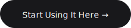
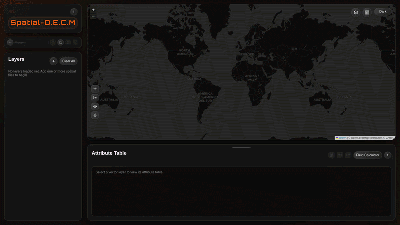

<div align="center">
  <br/>
  
  <br/><br/>
  <p><em>A lightweight, browser-based GIS viewer and editor</em></p>
</div>

<br/>

<div align="center">
  <a href="https://anandhusjone.github.io/Spatial-DECM/">
    
  </a>
</div>

<br/>

<p align="center">
  
</p>

## Why this exists

Full GIS software like QGIS or ArcGIS is powerful — but often overkill. Opening a single `.geojson` file shouldn't require a 2GB install.

**Spatial DECM is for those in-between moments.** Quick edits. Fast previews. No setup. Runs entirely in your browser.

<br/>

## Features

<table>
<tr>
<td width="50%" valign="top">

**📂 Data**

Drag-and-drop upload · File picker · Multiple vector/raster layers · Auto-zoom · Per-layer visibility

<br/>

**🗺️ Map**

Top toolbar basemap switcher · CartoDB Dark / Light · Google Satellite · OpenTopoMap · Dark / Light / System theme · Attribute table toggle

<br/>

**✏️ Editing**

Create layers · Add points, lines, polygons · Edit geometries · Attribute table editing · Add custom fields

<br/>

**🧮 Field Calculator**

QGIS-style expressions · Arithmetic · String ops (`||`) · `CASE WHEN` · Null checks · Spatial functions · Preview before applying · Save & reuse expressions

<br/>

**📐 Measure Tool**

Distance and area measurement · Live cursor preview · Multi-segment polyline · Polygon area on 3+ points

<br/>

**📍 GPS Locate**

One-click device location · Accuracy circle · Auto-zoom to position

</td>
<td width="50%" valign="top">

**📊 Spatial Functions**

`AREA()` · `LENGTH()` · `PERIMETER()` · `LATITUDE()` · `LONGITUDE()` · `CENTROID_LAT()` · `CENTROID_LON()`

<br/>

**🎨 Styling**

Advanced point / line / polygon symbols · Categorized · Graduated · Rule-based styling · Labels with halo/background/scale controls · Raster gray / pseudocolor · Color ramps · Query builder with `AND` / `OR` filters

<br/>

**🔥 Analysis**

Heatmap · IDW interpolation · Gaussian Kernel interpolation · Nearest Neighbor interpolation · Viewshed (line-of-sight) · **Watershed & Channel Extraction**

<br/>

**💾 Project Workspace**

Save / load `.sdecm` project bundles · File System Access API for live folder workspaces · Auto-save (5 s debounce) · Ctrl+S shortcut · Dirty-state tracking

<br/>

**📤 Export**

GeoJSON · KML · Zipped Shapefile

</td>
</tr>
</table>

<br/>

## Supported Formats

| Format | Notes |
|--------|-------|
| `.geojson` / `.json` | Standard GeoJSON |
| `.kml` | Keyhole Markup Language |
| `.gpx` | GPS Exchange Format |
| `.zip` | Zipped shapefile bundle — must include `.shp`, `.shx`, `.dbf` |
| `.shp` + sidecars | Loose shapefile import — select or drag the matching `.shp`, `.dbf`, `.shx`, `.prj`, and `.cpg` files together |
| `.csv` | Lat/lon columns (`lat`, `lon`, `lng`, `x`, `y`) **or** a combined column (`coordinates`, `coords`, `location`, `point`, etc.) with values like `"8.42, 77.04"`. Delimiter auto-detected: comma, semicolon, tab, or pipe. Large files (> 50 000 points) use streaming mode — see [Large CSV files](#large-csv-files). |
| `.tif` / `.tiff` | GeoTIFF raster with tiled browser rendering, raster metadata, pixel sampling, NoData handling, and WGS84 / Web Mercator / WGS84 UTM alignment. Also used as DEM input for viewshed and watershed analysis. |

<br/>

## Usage

```
1. Open the app
2. Drag and drop your file
3. View, edit, or analyze
4. Export when done
```

> All processing happens **client-side**. Your data never leaves your browser.  
> Large datasets may run slower due to browser memory limits.

<br/>

## Large CSV files

CSV files are parsed in a background worker so the UI stays responsive during import. The worker reads the file in 2 MB chunks, detects the delimiter automatically, and applies a streaming reservoir-sample / tile-grid algorithm:

| Point count | Mode | What you see on the map |
|-------------|------|-------------------------|
| ≤ 50 000 | **Full vector** | Every point rendered as a normal vector layer |
| 50 001 – 250 000 | **Sample preview** | Up to 20 000 randomly sampled points (reservoir sampling) |
| > 250 000 | **Grid preview** | One polygon per map tile (zoom 8) showing the point count for that cell |

- The layer card shows the total point count from the file, not just the displayed points.
- A separate **analysis sample** of up to 50 000 points (reservoir-sampled) is kept in memory for heatmap, interpolation, and field-calculator operations.
- Filtering and query-builder rules are skipped for large CSV layers (filters apply to the full dataset on re-import instead).
- Export reflects the display mode (`sample-preview` or `grid-preview`); re-import the original file and keep it under 50 000 points to export the full dataset.

<br/>

## Viewshed Analysis

Viewshed analysis computes which areas of the terrain are visible from a chosen observer point. Click the **Viewshed** toolbar button to open the panel.

**Elevation sources**

| Mode | Source | Resolution |
|------|--------|-----------|
| Local DEM | Any single-band GeoTIFF loaded into the layer panel | Native raster resolution |
| Global DEM | [AWS Open Data — Terrain Tiles (Terrarium)](https://registry.opendata.aws/terrain-tiles/) | ~30 m/px at zoom 12 |

When *Use Global DEM* is ticked the app fetches RGB-encoded Terrarium elevation tiles (`https://s3.amazonaws.com/elevation-tiles-prod/terrarium/{z}/{x}/{y}.png`) and stitches them into a single in-memory float grid before running the algorithm. A maximum of 64 tiles is fetched per run (≈ 50 km radius at most latitudes).

**Algorithm** — Radial Bresenham line-of-sight sweep (`app/60-viewshed.js`). For every pixel on the DEM perimeter a ray is cast from the observer outward. A cell is marked visible if its angle of elevation from the observer equals or exceeds the running maximum angle seen on that ray so far. Optional Earth-curvature and atmospheric-refraction correction uses k = 0.13.

**Output** — A raster overlay layer named *Viewshed* is added to the map. Visible cells are painted in semi-transparent green (`rgba(0, 255, 120, 0.45)`). The map legend shows two swatches (Visible / Not visible).

<br/>

## Watershed & Channel Extraction

<p align="center">
  
</p>

Watershed analysis delineates upstream drainage basins and extracts stream channel networks from a DEM. Click the **Watershed** toolbar button to open the panel.

**Elevation sources** — same Local / Global DEM options as Viewshed (shared tile utilities in `app/dem-utils.js`).

**AOI modes**

| Mode | How it works |
|------|-------------|
| **Pour Point** | Click a point on the map; it snaps to the nearest stream cell and delineates the full upstream basin |
| **Polygon** | Draw a freehand polygon; channels and sub-basins are clipped to that extent |
| **Canvas** | Uses the current map viewport as the analysis extent (Global DEM only) |

**Parameters**

- **Flow accumulation threshold** — minimum upstream cell count to classify a cell as a stream channel. Lower values produce denser networks.
- **Minimum slope** — Wang & Liu (2006) sink-fill gradient (default 1×10⁻⁴ m/m). Prevents flat-terrain flow stagnation by imposing a gentle drainage gradient across filled depressions.
- **Sub-basins** — optional toggle to subdivide the delineated basin at channel confluences.

**Algorithm** — D8 flow direction with Wang & Liu sink-fill, GPU-accelerated via WebGL 1 where available (falls back to CPU workers automatically). Flow accumulation, basin delineation, and sub-basin extraction each run in dedicated Web Workers to keep the UI responsive. A cancel button terminates all active workers immediately.

**Output** — Two vector layers are added to the map: *Stream Channels* (polylines) and *Watershed Basin* (polygon, with optional sub-basin polygons).

<br/>

## CRS handling

Coordinate system detection, validation, transformation, and layer reprojection are centralized in `app/crs-manager.js`. The app uses Proj4 when available, includes built-in support for WGS84, Web Mercator, and WGS84 UTM zones, and exposes registration hooks for custom CRS definitions. Vector imports with declared CRS metadata are normalized to the map CRS, and GeoTIFF rasters use the same CRS service for alignment and sampling.

GeoJSON files that declare an unrecognised CRS are imported with a console warning and treated as WGS84 per RFC 7946 §4, rather than rejected.

## Styling and labeling

Vector styling and labeling are centralized in `app/vector-style-manager.js`. Point layers support circle, square, triangle, star, cross, and custom icon symbols with size, fill, stroke, and opacity controls. Line layers support width, color, opacity, dash styles, custom dash patterns, caps, and joins. Polygon layers support fill opacity, outline-only rendering, stroke color, width, opacity, and stroke styles.

Labels can be enabled per layer with a field or `{field}` template expression, font styling, text opacity, halo, background, border, offsets, rotation, priority, overlap avoidance, and min/max zoom visibility. Style and label edits are applied live and saved with project files.

<br/>

## Project Workspace

Projects are saved as `.sdecm` bundles (a JSON manifest + per-layer GeoJSON files). In browsers that support the **File System Access API** (Chrome / Edge), the app can read and write directly to a local folder — enabling Ctrl+S saves and 5-second auto-save. In other browsers a `.sdecm` zip bundle is downloaded instead. On reload, FSA workspaces are automatically re-connected with a single permission prompt.

<br/>

## Source layout

| File | Role |
|------|------|
| `app/00-core.js` | Global constants, shared helpers, theme/basemap (Dark · Light · Satellite · Topo), modal and status utilities |
| `app/10-analysis-layers.js` | Layer management, CSV parsing & streaming worker, GeoJSON normalisation, interpolation, heatmap, export |
| `app/20-tools-ui.js` | Toolbar, layer list UI, style/label panels, filter/query builder, export modal |
| `app/30-bootstrap.js` | App initialisation, file-drop handling, drag-and-drop wiring |
| `app/40-project.js` | Project save/load (`.sdecm` bundle or FSA folder), auto-save, dirty-state tracking |
| `app/50-map-tools.js` | GPS locate, distance/area measure tool |
| `app/60-viewshed.js` | Viewshed analysis panel, tile fetching, Bresenham line-of-sight algorithm |
| `app/70-watershed.js` | Watershed & channel extraction — D8 flow direction, Wang & Liu sink-fill, WebGL GPU acceleration, Web Worker offloading |
| `app/99-help-content.js` | In-app help text |
| `app/calculator/` | Field calculator — tokenizer, parser, AST, evaluator, built-in function catalog |
| `app/crs-manager.js` | CRS detection, Proj4 reprojection, UTM zone helpers |
| `app/dem-utils.js` | Shared DEM / Terrarium tile utilities — tile fetching, stitching, coordinate transforms (used by viewshed & watershed) |
| `app/vector-style-manager.js` | Symbol rendering, categorised/graduated/rule-based styling, label engine. |

<br/>

## Who is this for?

- Students learning GIS for the first time
- Non-GIS users who need quick access to GIS
- Developers working with spatial data
- Anyone who finds a full GIS software too heavy for simple tasks

<br/>

## Philosophy

Spatial DECM is **not** a replacement for QGIS or ArcGIS.  
It's built for the moments when those feel like overkill.

<br/>

<div align="center">
  <sub>Built for the browser. Built for simplicity.</sub>
</div>

<br/>

<div align="center">
  <a href="https://anandhusjone.github.io/Spatial-DECM/">
    
  </a>
</div>
